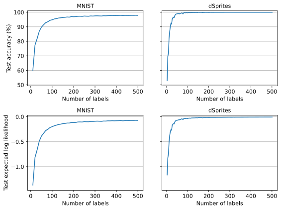

# SimCLR embeddings of MNIST and dSprites images

This repo contains code adapted from [`lightly`](https://github.com/lightly-ai/lightly) for use in [`epig`](https://github.com/fbickfordsmith/epig)'s pipeline for semi-supervised Bayesian active learning.
It might also be useful elsewhere.


## Results

<div align="center">
	
</div>

Predictive performance of a linear classifier trained on an increasing number of labelled embeddings (class-balanced random samples).


## Getting set up

Clone the repo and move into it:

```bash
git clone https://github.com/fbickfordsmith/simclr-embeddings.git && cd simclr-embeddings
```

If you're not using a CUDA device, remove the `cudatoolkit` and `pytorch-cuda` dependencies in `environment.yaml`.

Create an environment using [Mamba](https://mamba.readthedocs.io) (or [Conda](https://conda.io), replacing `mamba` with `conda` below) and activate it:

```bash
mamba env create --file environment.yaml && mamba activate simclr-embeddings
```


## Reproducing the results

Train encoders:

```bash
for dataset in dsprites mnist; do
    echo "Training encoder - ${dataset}"
    python train_encoder.py --dataset ${dataset}
done
```

Compute embeddings:

```bash
for dataset in mnist dsprites; do
    echo "Computing embeddings - ${dataset}"
    python compute_embeddings.py --dataset ${dataset}
done
```

Evaluate the embeddings in downstream classification:

```bash
for dataset in mnist dsprites; do
    echo "Evaluating embeddings - ${dataset}"
    for seed in {0..19}; do
        python evaluate_embeddings.py --dataset ${dataset} --seed ${seed}
    done
done
```

Plot the results:

```bash
python plot_results.py
```


## Citing this work

[`lightly`](https://github.com/lightly-ai/lightly) repo:

```bibtex
@misc{susmelj§2020lightly,
    author = {Susmelj, Igor and Heller, Matthias and Wirth, Philipp and Prescott, Jeremy and Ebner, Malte and others},
    year = {2020},
    title = {Lightly},
    howpublished = {https://github.com/lightly-ai/lightly},
}
```

This repo:

```bibtex
@article{bickfordsmith2024making,
    author = {{Bickford Smith}, Freddie and Foster, Adam and Rainforth, Tom},
    year = {2024},
    title = {Making better use of unlabelled data in {Bayesian} active learning},
    journal = {International Conference on Artificial Intelligence and Statistics},
}
```


### Training methods

SimCLR:

```bibtex
@article{chen2020simple,
    author = {Chen, Ting and Kornblith, Simon and Norouzi, Mohammad and Hinton, Geoffrey},
    year = {2020},
    title = {A simple framework for contrastive learning of visual representations},
    journal = {International Conference on Machine Learning},
}
```